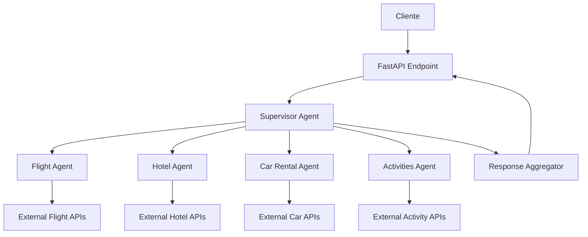

# Arquitectura de Agente Supervisor - Customer Support de Viajes

## Estructura de Carpetas Recomendada

```
travel-support-agent/
├── app/
│   ├── __init__.py
│   ├── main.py                 # FastAPI app principal
│   ├── config/
│   │   ├── __init__.py
│   │   ├── settings.py         # Configuraciones generales
│   │   └── database.py         # Configuración de BD
│   ├── api/
│   │   ├── __init__.py
│   │   ├── routes/
│   │   │   ├── __init__.py
│   │   │   ├── chat.py         # Endpoints de chat
│   │   │   ├── health.py       # Health checks
│   │   │   └── webhooks.py     # Webhooks si necesarios
│   │   └── middleware/
│   │       ├── __init__.py
│   │       ├── auth.py         # Autenticación
│   │       └── logging.py      # Logging middleware
│   ├── agents/
│   │   ├── __init__.py
│   │   ├── supervisor/
│   │   │   ├── __init__.py
│   │   │   ├── agent.py        # Agente supervisor principal
│   │   │   ├── graph.py        # LangGraph definition
│   │   │   └── prompts.py      # Prompts del supervisor
│   │   ├── flights/
│   │   │   ├── __init__.py
│   │   │   ├── agent.py        # Agente de vuelos
│   │   │   ├── tools.py        # Tools específicas de vuelos
│   │   │   └── prompts.py
│   │   ├── hotels/
│   │   │   ├── __init__.py
│   │   │   ├── agent.py        # Agente de hoteles
│   │   │   ├── tools.py
│   │   │   └── prompts.py
│   │   ├── cars/
│   │   │   ├── __init__.py
│   │   │   ├── agent.py        # Agente de renta de carros
│   │   │   ├── tools.py
│   │   │   └── prompts.py
│   │   ├── activities/
│   │   │   ├── __init__.py
│   │   │   ├── agent.py        # Agente de excursiones
│   │   │   ├── tools.py
│   │   │   └── prompts.py
│   │   └── base/
│   │       ├── __init__.py
│   │       ├── agent.py        # Clase base para agentes
│   │       └── tools.py        # Tools compartidas
│   ├── services/
│   │   ├── __init__.py
│   │   ├── external_apis/
│   │   │   ├── __init__.py
│   │   │   ├── amadeus.py      # API de vuelos
│   │   │   ├── booking.py      # API de hoteles
│   │   │   ├── hertz.py        # API de carros
│   │   │   └── viator.py       # API de actividades
│   │   ├── database/
│   │   │   ├── __init__.py
│   │   │   ├── models.py       # SQLAlchemy models
│   │   │   └── repositories.py # Data access layer
│   │   └── llm/
│   │       ├── __init__.py
│   │       ├── factory.py      # LLM factory
│   │       └── embeddings.py   # Embeddings service
│   ├── schemas/
│   │   ├── __init__.py
│   │   ├── chat.py            # Pydantic schemas para chat
│   │   ├── flights.py         # Schemas de vuelos
│   │   ├── hotels.py          # Schemas de hoteles
│   │   ├── cars.py            # Schemas de carros
│   │   └── activities.py      # Schemas de actividades
│   └── utils/
│       ├── __init__.py
│       ├── logging.py         # Utilidades de logging
│       ├── exceptions.py      # Custom exceptions
│       └── validators.py      # Validadores customizados
├── tests/
│   ├── __init__.py
│   ├── conftest.py           # Pytest configuration
│   ├── unit/
│   │   ├── test_agents/
│   │   ├── test_tools/
│   │   └── test_services/
│   └── integration/
│       ├── test_api/
│       └── test_workflows/
├── docs/
│   ├── architecture.md
│   ├── api_documentation.md
│   └── deployment.md
├── requirements.txt
├── Dockerfile
├── docker-compose.yml
├── .env.example
└── README.md
```

## Arquitectura del Sistema

### 1. Patrón Supervisor Multi-Agente



### 2. Flujo de LangGraph

El supervisor utiliza un StateGraph que:
- Analiza la consulta del usuario
- Decide qué agente(s) especializado(s) invocar
- Coordina las respuestas
- Proporciona una respuesta unificada

### 3. Componentes Clave

#### Supervisor Agent
```python
# Responsabilidades:
- Clasificación de intents
- Routing a agentes especializados
- Coordinación de respuestas
- Manejo de conversaciones complejas
- Escalación a humanos si es necesario
```

#### Agentes Especializados
```python
# Cada agente tiene:
- Herramientas específicas de su dominio
- Prompts optimizados para su especialidad
- Acceso a APIs externas relevantes
- Capacidad de mantener contexto
```

### 4. Herramientas por Agente

#### Flight Agent Tools
- `search_flights`: Buscar vuelos disponibles
- `get_flight_details`: Detalles de vuelo específico
- `modify_flight_booking`: Modificar reserva
- `cancel_flight_booking`: Cancelar reserva
- `check_flight_status`: Estado de vuelo

#### Hotel Agent Tools
- `search_hotels`: Buscar hoteles
- `get_hotel_details`: Detalles de hotel
- `check_availability`: Verificar disponibilidad
- `modify_hotel_booking`: Modificar reserva
- `cancel_hotel_booking`: Cancelar reserva

#### Car Rental Agent Tools
- `search_cars`: Buscar vehículos disponibles
- `get_car_details`: Detalles de vehículo
- `modify_car_booking`: Modificar reserva
- `cancel_car_booking`: Cancelar reserva
- `get_rental_locations`: Ubicaciones de renta

#### Activities Agent Tools
- `search_activities`: Buscar actividades/excursiones
- `get_activity_details`: Detalles de actividad
- `check_activity_availability`: Verificar disponibilidad
- `book_activity`: Reservar actividad
- `cancel_activity_booking`: Cancelar reserva

### 5. Tecnologías y Patrones

#### Stack Tecnológico
- **FastAPI**: API REST y WebSocket endpoints
- **LangChain**: Framework de agentes
- **LangGraph**: Orquestación de workflows
- **Pydantic**: Validación de datos
- **SQLAlchemy**: ORM para persistencia
- **Redis**: Cache y session storage
- **PostgreSQL**: Base de datos principal

#### Patrones de Diseño
- **Factory Pattern**: Para creación de agentes y LLMs
- **Repository Pattern**: Para acceso a datos
- **Strategy Pattern**: Para diferentes APIs externas
- **Observer Pattern**: Para logging y monitoring
- **Circuit Breaker**: Para APIs externas

### 6. Consideraciones de Implementación

#### Manejo de Estado
```python
# Estado compartido entre agentes
class ConversationState(TypedDict):
    user_id: str
    session_id: str
    conversation_history: List[Dict]
    current_intent: str
    context: Dict
    active_booking: Optional[Dict]
```

#### Routing Logic
```python
# El supervisor decide el routing basado en:
- Intent classification
- Entidades extraídas
- Contexto de conversación
- Estado de booking activo
```

#### Error Handling
```python
# Manejo robusto de errores:
- Retry logic para APIs externas
- Fallback responses
- Escalación a humanos
- Logging comprehensivo
```

### 7. APIs Externas Sugeridas

- **Vuelos**: Amadeus, Skyscanner API
- **Hoteles**: Booking.com, Expedia API
- **Carros**: Hertz, Enterprise API
- **Actividades**: Viator, GetYourGuide API

### 8. Deployment

#### Docker Configuration
```dockerfile
# Multi-stage build para optimización
# Separación de dependencias
# Health checks integrados
```

#### Orchestration
```yaml
# docker-compose.yml incluye:
- FastAPI app
- PostgreSQL
- Redis
- Nginx (reverse proxy)
- Monitoring stack
```

### 9. Monitoring y Observabilidad

- **Logs**: Structured logging con contexto
- **Metrics**: Custom metrics para agentes
- **Tracing**: Distributed tracing
- **Health Checks**: Endpoints de salud
- **Alerting**: Alertas por fallos de agentes

Esta arquitectura te proporciona una base sólida, escalable y mantenible para tu agente supervisor de customer support de viajes.
